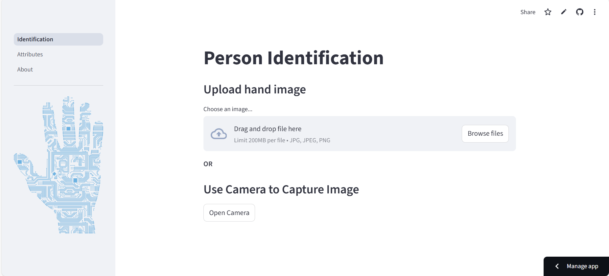
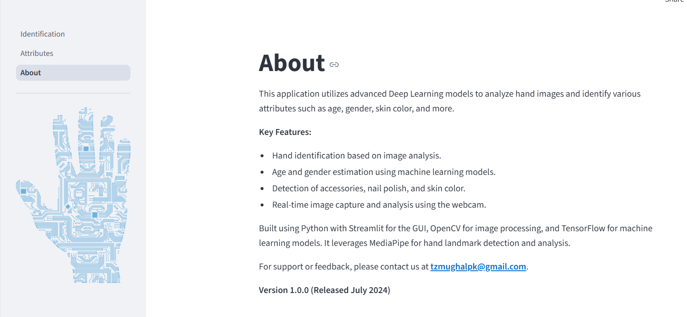

# person-identification-using-hand-samples
Person &amp; Attributes Identification using Palm and Hand Samples

 <!-- Replace with your banner image -->

A powerful deep learning web application that uses **hand image analysis** to predict **age**, **gender**, **skin color**, and identify **accessories** or **nail polish** from static images or live webcam input.

Built with 🐍 Python, 🎯 TensorFlow, 📸 OpenCV, and 🖐️ MediaPipe — all wrapped in a smooth **Streamlit** interface.

---

## 📌 Key Features

- ✋ **Hand Identification** from images or webcam
- 👶🧓 **Age Estimation**
- 🚻 **Gender Prediction**
- 🎨 **Skin Color Detection**
- 💍 **Accessory Recognition** (e.g., rings, watches)
- 💅 **Nail Polish Detection**
- 📸 **Real-time Webcam Analysis**
- ⚙️ Easy-to-use and lightweight GUI

---

## 🚀 Demo

👉 [Launch App Now](https://person-identification.streamlit.app/)

---

## 🧠 How It Works

1. Upload a hand image or capture it using your webcam.
2. The app uses **MediaPipe** to detect hand landmarks.
3. Features are extracted using **OpenCV**.
4. Predictions are made using **TensorFlow** deep learning models.
5. Results (age, gender, skin tone, etc.) are shown on screen with annotated feedback.

---

## 🛠 Tech Stack

| Technology     | Role                         |
|----------------|------------------------------|
| Python         | Core logic & backend         |
| Streamlit      | Web GUI                      |
| OpenCV         | Image processing             |
| TensorFlow     | Deep learning model backend  |
| MediaPipe      | Hand landmark detection      |

---

## 🖼 Screenshots

| Description                  | Screenshot              |
|------------------------------|--------------------------|
| 🔍 Biometric Identification  |  |
| 📸 Attributes Identification |  |
| 🧠 About Section              |      |

---

